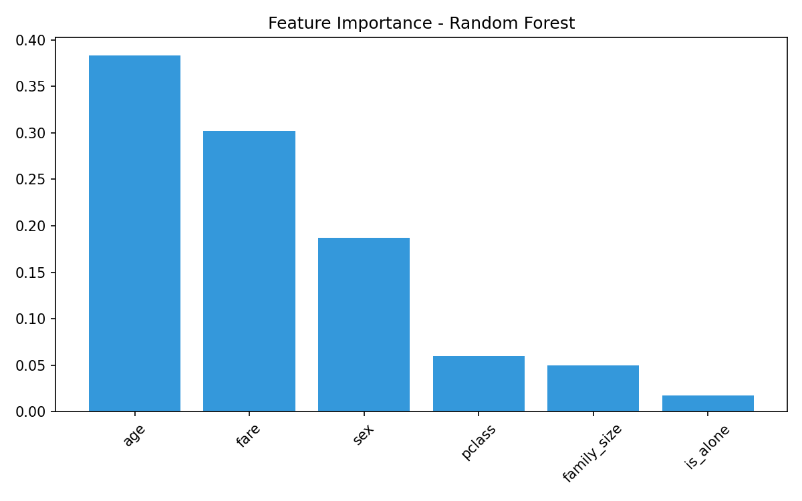

# 🤖 ML Practice — Machine Learning & AI Projects in Python

[](https://python.org)
[](https://scikit-learn.org)
[](https://pandas.pydata.org)
[](https://openai.com)
[](LICENSE)

A collection of **8 Python projects** covering the full machine learning lifecycle — from data cleaning and feature engineering to model training, evaluation, and production AI integration with the OpenAI API and RAG.

Built as part of my graduate studies in Computer Engineering at SMU and continued personal development in Python ML and generative AI.

---

## 📁 Project Overview

| # | File | Topic | Key Concepts |
|---|------|-------|--------------|
| 1 | `hello_ml.py` | Linear Regression from Scratch | Mean, variance, covariance, gradient descent |
| 2 | `kmeans.py` | K-Means Clustering from Scratch | Euclidean distance, centroid update, convergence |
| 3 | `pandas_practice.py` | Pandas Data Analysis | DataFrame ops, missing values, groupby, filtering |
| 4 | `sklearn_pipeline.py` | Scikit-learn ML Pipeline | Train/test split, scaling, logistic regression, evaluation |
| 5 | `visualization.py` | Matplotlib Dashboard | 4-panel chart: bar, histogram, scatter, box plot |
| 6 | `titanic_classification.py` | End-to-End Classification | Feature engineering, Random Forest, model comparison |
| 7 | `openai_demo.py` | OpenAI API + RAG | Few-shot prompting, Chain-of-Thought, RAG simulation |
| 8 | `data_cleaning.py` | Real-World Data Cleaning | Deduplication, outlier detection, email/date validation |

---

## 🔍 Project Details

### 1. Linear Regression from Scratch (`hello_ml.py`)
Implements linear regression **without any ML libraries** to demonstrate the underlying math.
- Manual calculation of mean, variance, and covariance
- Slope and intercept derivation from first principles
- Predicts exam scores from hours studied

### 2. K-Means Clustering (`kmeans.py`)
Builds K-means from scratch with step-by-step centroid updates.
- Euclidean distance calculation
- Random centroid initialization
- Convergence detection via centroid movement threshold

### 3. Pandas Data Analysis (`pandas_practice.py`)
Practical data manipulation covering the most common real-world Pandas patterns.
- DataFrame creation, inspection, and summary statistics
- Missing value detection and imputation strategies
- Conditional filtering, multi-column sorting, and `groupby` aggregation

### 4. Scikit-learn ML Pipeline (`sklearn_pipeline.py`)
Production-style ML pipeline with preprocessing and evaluation baked in.
- `train_test_split` with stratification
- `StandardScaler` feature normalization
- Logistic Regression training, accuracy reporting, and confidence scores on new data

### 5. Matplotlib Visualization Dashboard (`visualization.py`)
Four-panel analytical dashboard for student performance data.
- Bar chart, histogram, scatter plot, and box plot in a single figure
- Pass/fail group comparison with visual annotations

### 6. Titanic Survival Prediction (`titanic_classification.py`)
End-to-end binary classification project on the Titanic dataset.
- Data cleaning: missing age imputation, cabin drop, encoding
- Feature engineering: `family_size`, `is_alone`, `title` extraction
- Model comparison: Logistic Regression vs. Random Forest
- Feature importance visualization (see `feature_importance.png`)



### 7. OpenAI API + RAG Demo (`openai_demo.py`)
Demonstrates real-world **Prompt Engineering** and **Retrieval-Augmented Generation** using the OpenAI API.
- Basic Chat Completions API integration
- **Few-shot classification**: guiding the model with labeled examples
- **Chain-of-Thought (CoT)** prompting for step-by-step reasoning
- **RAG simulation**: injecting SMU coursework context into the prompt to ground responses

### 8. Data Cleaning Pipeline (`data_cleaning.py`)
Robust data cleaning pipeline designed for messy real-world datasets.
- Duplicate detection and removal
- Missing value handling with domain-appropriate strategies
- String normalization (whitespace, casing, special characters)
- Outlier detection using IQR method
- Email format validation with regex
- Date format standardization across inconsistent formats

---

## 🛠 Tech Stack

```
Python 3.10+    Pandas      NumPy       scikit-learn
Matplotlib      OpenAI API  Regex       Statistics (stdlib)
```

---

## 🚀 Getting Started

```bash
# Clone the repo
git clone https://github.com/Haochen0416/ml-practice.git
cd ml-practice

# Install dependencies
pip install pandas numpy scikit-learn matplotlib openai

# Run any project
python titanic_classification.py
python openai_demo.py   # Requires OPENAI_API_KEY env variable
```

For the OpenAI demo, set your API key:
```bash
export OPENAI_API_KEY="your-api-key-here"
```

---

## 📊 Skills Demonstrated

- **Data Engineering**: cleaning, transformation, validation, feature engineering
- **Classical ML**: regression, classification, clustering, model evaluation
- **AI Integration**: OpenAI API, prompt engineering, few-shot learning, RAG
- **Visualization**: multi-panel dashboards, feature importance plots
- **Python Best Practices**: modular code, clear documentation, reproducible pipelines

---

## 👤 Author

**Haochen Li**  
M.S. Computer Engineering — Southern Methodist University (SMU), Dallas TX  
📧 haochenl@smu.edu · 🔗 [github.com/Haochen0416](https://github.com/Haochen0416)
